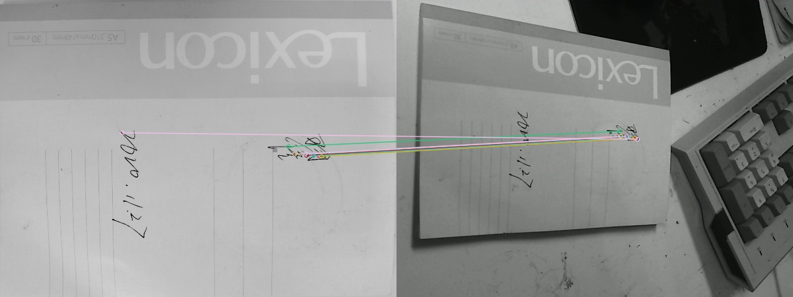

# A simple demo for AR 

基于**ORB特征提取**的AR demo，在这个demo中，我们展示如何获取一个指定物体的平面信息，并在上面投影一个3D立体的物体。


## 准备工作

要做到检测平面，首先要准备一个平面，然后在视频流中找到该平面的**特征点**，以实现跟踪。

要实现**既定平面**的检测，最直接的办法是特征点，比如ORB特征，角点特征等等，这些特征的提取无外乎就是各个像素点的形状、光流来判断是否具有相似的匹配的点，而这些算法实现起来却有点复杂。但是，我们用opencv就可以简单的实现它。

首先准备一张模板图片(放在reference文件夹下)。这张图片就是要检测的平面，为了更平稳的检测，可以在照片上加上更多的特点。

接下来就要调用摄像头，然后在视频流中检测刚刚那张模板图片，并进行特征点检测和对应。


```python
import cv2
import numpy as np
# 调用摄像头设备
device = 0
cap =cv2.VideoCapture(device)

min_matches = 15
model = cv2.imread('model.jpg', 0)
print(model.shape)
while True:
    res, frame = cap.read(0)
    if res:
        cv2.imshow('cap', frame)
        if cv2.waitKey(1) & 0xFF == ord('q'):
            break;
```


## 特征匹配

接下来完成一个十分简单的任务，从视频流里面把图片给找出来。简单的来说，就是做特征匹配。在opencv中，有一个 `cv2.ORB_create()`的类，该类可以创建一个ORB的特征提取器，通过特征提取，就可以得到相应的特征点，在通过匹配器进行匹配。

核心步骤如下：

```python
model = cv2.imread('reference/model.jpg', 0)
device = 0
cap = cv2.VideoCapture(device)

size = (int(cap.get(cv2.CAP_PROP_FRAME_WIDTH)),
        int(cap.get(cv2.CAP_PROP_FRAME_HEIGHT)))
cv2.resizeWindow("camera", size[0], size[1])
while True:
    # read the current frame
    ret, frame = cap.read(0)
    if ret:
        orb = cv2.ORB_create()
        bf = cv2.BFMatcher(cv2.NORM_HAMMING, crossCheck=True)
        kp_model, des_model = orb.detectAndCompute(model, None)
        kp_frame, des_frame = orb.detectAndCompute(frame, None)

        matches = bf.match(des_model, des_frame)
        matches = sorted(matches, key=lambda x: x.distance)

        res = cv2.drawMatches(model, kp_model, frame, kp_frame,
                              matches[: MIN_MATCHES], 0, flags=2)
        cv2.imshow('res', res)#匹配对应图像
        cv2.waitKey(0)
```
经过BFMatcher 的匹配之后，我们这里的匹配使用的是Hamming距离进行的，如果你要对这里用到的原理进行深究，也可以看看一些关于汉明距离的介绍。

如果你运行之后，应该可以看到特征匹配的图了（res.jpg）。




## 目标标识

做到这里还不够。我们最好将目标用方框标识出来，这样方便我们后续进行平面映射。简单的来说，这个步骤是最难得部分，我们需要根据模板图片，找到相对于目标图片的映射关系，进而确定一个转换的矩阵，这个操作叫做Homography, 单应性矩阵。

```
src_pts = np.float32([kp_model[m.queryIdx].pt for m in matches]).reshape(-1, 1, 2)
dst_pts = np.float32([kp_frame[m.trainIdx].pt for m in matches]).reshape(-1, 1, 2)
# compute Homography
M, mask = cv2.findHomography(src_pts, dst_pts, cv2.RANSAC, 5.0)
h, w = model.shape[0], model.shape[1]
pts = np.float32([[0, 0], [0, h - 1], [w - 1, h - 1], [w - 1, 0]]).reshape(-1, 1, 2)
# project corners into frame
dst = cv2.perspectiveTransform(pts, M)  
# connect them with lines
img2 = cv2.polylines(frame, [np.int32(dst)], True, 255, 3, cv2.LINE_AA) 
```

上面步骤是在检测到 模板图片的关键点、每一帧的关键点的基础上做的。接下来要实现的是如何把我们的3D模型放到平面上去了。

## 最后一步

这一步要解决两个问题：

1. 根据单应性矩阵和相机外参，得到矫正的坐标系，并把OBJ立体模型放置上面；
2. 如何解析OBJ？


如果上图所示，通常情况下，相机的外参都会有四个参数。三维坐标系的三个坐标，以及一个旋转角度。我们可以把z去掉，也就是把R3拿掉，因为我们是要把OBJ投影到一个平面内，那么z就自然都是0了。


接着是十分复杂的一顿运算，有兴趣的朋友可以推导一下，如果将3D的模型投影到平面上。总之我们直接用代码来展示一下最终效果：

```
def projection_matrix(camera_parameters, homography):
    """
    From the camera calibration matrix and the estimated homography
    compute the 3D projection matrix
    """
    # Compute rotation along the x and y axis as well as the translation
    homography *= -1
    rot_and_transl = np.dot(np.linalg.inv(camera_parameters), homography)
    col_1 = rot_and_transl[:, 0]
    col_2 = rot_and_transl[:, 1]
    col_3 = rot_and_transl[:, 2]
    # normalise vectors
    l = math.sqrt(np.linalg.norm(col_1, 2) * np.linalg.norm(col_2, 2))
    rot_1 = col_1 / l
    rot_2 = col_2 / l
    translation = col_3 / l
    # compute the orthonormal basis
    c = rot_1 + rot_2
    p = np.cross(rot_1, rot_2)
    d = np.cross(c, p)
    rot_1 = np.dot(c / np.linalg.norm(c, 2) + d / np.linalg.norm(d, 2), 1 / math.sqrt(2))
    rot_2 = np.dot(c / np.linalg.norm(c, 2) - d / np.linalg.norm(d, 2), 1 / math.sqrt(2))
    rot_3 = np.cross(rot_1, rot_2)
    # finally, compute the 3D projection matrix from the model to the current frame
    projection = np.stack((rot_1, rot_2, rot_3, translation)).T
    return np.dot(camera_parameters, projection)
```

最后你就可以从视频流中，在你的目标物体上放置一个3D物体。


## 代码使用

将自己的模板图片替换掉reference下面的图片，另外，请确保你的电脑上有可用的摄像头设备。

运行：

```python
python main.py
```

